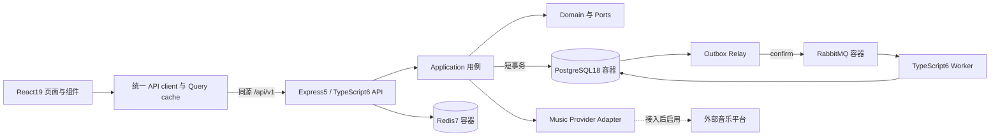

# 总体与 TypeScript 6 后端方案

状态：**仅设计，业务代码待实现**。首版是一个模块化单体，API 和 Worker 为两个进程；共享同一套用例与 PG18 模型。已有前端视觉资产继续复用。

## 已确认的产品边界

- 正式账号密码注册/登录；用户已确认密码采用 **Argon2id**，不采用 MD5。
- 音乐平台先预留统一适配接口，不把平台接入、授权音源、完整歌词或下载能力算作首版已完成。
- 已有首页、收藏、发现、搜索、详情、愿望单、我的、设置、播放器、横屏展示纳入设计；导入补真实入口。
- 首版覆盖账户内收藏、喜欢、愿望单、私人目录录入与批量导入。支付、交易、社交、会员、离线下载、AI 生成、推荐算法不进入本次实现范围。
- 现有无功能的播放列表、下载、统计入口保留在后续能力清单，首版不显示可点击的假入口。设计画板仅作为开发工具。

## 技术决策

| 项目 | 决策 | 理由与验证边界 |
| --- | --- | --- |
| 运行时 | Node.js 24 LTS；实施时固定补丁版本 | 当前本机 24.18.0；API 与 Worker 使用同版本 |
| 后端语言 | TypeScript **6.0.3**，ESM、`NodeNext`、`strict` | 6.0.3 注册表可用；不得用 TS7/latest 替代用户指定版本 |
| HTTP | Express 5 | 复用现有 Express 生态；目前只有 Express4 依赖，无旧 server 路由兼容负担 |
| 契约 | OpenAPI 3.1 + JSON Schema；Ajv 8/2020 + ajv-formats 校验 | 契约是单一事实源；openapi-typescript 生成客户端类型 |
| 数据访问 | `pg` 连接池 + 显式参数化 SQL；node-pg-migrate 前滚迁移 | 避免引入与当前规模不匹配的 ORM/通用 Repository |
| Redis | Redis 7 + node-redis | 会话、限流、可重建目录缓存；不存收藏权威状态 |
| MQ | RabbitMQ 4 系列 + amqplib | 导入预处理、导入提交任务；Outbox 确保 PG 与 MQ 一致性 |
| 前端 | React19、现有 Tailwind4/Motion/Lucide/Three；React Router、TanStack Query | 复用现有视觉组件，新增 URL 路由和服务端缓存 |
| 密码 | 成熟 `argon2` 库，Argon2id PHC 字符串 | 参数基线 m=65536 KiB、t=3、p=1、随机盐16字节、hash32字节；目标环境测量后锁定 |
| 测试 | Vitest、Supertest、真实 PG18/Redis7/RabbitMQ 隔离环境 | fixture 只用于供应商，不代替数据库约束验证 |

库补丁版本由 BC00 兼容探针确定并进入 lockfile，不能声称这些新依赖已通过 TS6 构建。已有无调用的 GenAI 依赖不是启用 AI 的理由。

## 运行拓扑



Redis/MQ 内网地址不进入浏览器。开发期 Vite 3000 将 `/api` 代理到 API 4000；前端始终使用相对路径。生产同源反向代理为后续部署工作，不在本次启动生产服务。

## 目标工程与职责

```text
frontend/
  package.json / tsconfig.json / vite.config.ts
  src/app/              router、providers、AppShell、ErrorBoundary
  src/features/         auth、catalog、collection、wishlist、imports、player
  src/components/common/  通用 UI，见前端组件设计
  src/components/vinyl/   复用的封套、唱片、唱针、木架呈现
  src/lib/api/          fetch client、生成 types、schema validators
  src/services/audio/   PlayerController、音效、浏览器媒体事件
backend/
  src/main.ts           HTTP 组合根
  src/worker.ts         Worker 与 Outbox 组合根
  src/interfaces/http/ routes、schema middleware、session/CSRF、error mapping
  src/application/     auth、catalog、collection、wishlist、imports、playback
  src/domain/          entity、value object、Repository/Provider 端口
  src/infrastructure/  postgres、redis、rabbitmq、password、providers
  src/components/common/  错误、游标、幂等、超时等领域无关能力
  migrations/          版本化前滚 SQL
  tests/               contract、integration、worker、auth
packages/contracts/    从本次 contracts 迁入的唯一 API 契约与生成脚本
infra/                 实施时的 Compose、环境样例和开发 bootstrap
```

本次不移动现有 `src`。BC00 独立迁移入口/静态资源/构建路径后保持页面外观；此后禁止根 `src` 和 `frontend/src` 双份业务实现。公用组件入口与 AGENTS 一致。

## 模块的用例与依赖

| 模块 | 用例 | 关键限制 |
| --- | --- | --- |
| auth | 注册、登录、查询会话、退出、改密码 | hash 不进 DTO；禁用用户和会话版本每次写请求检查 |
| catalog | 专辑/发行版/艺术家、搜索、策展、条码匹配 | 全局已审核目录与用户私人录入分开；不按数组下标关联 |
| collection | 查询、入藏、编辑品相/价格/备注、移除 | owner 来自会话；`(user_id, release_id)` 唯一；不改变公共目录 |
| favorites | 喜欢/取消喜欢 | 与实体收藏独立；幂等 PUT/DELETE |
| wishlist | 新增、编辑目标价/品相、移除 | 不自动购买，不与实体收藏强制互斥 |
| imports | 预处理、逐行确认、提交、查询结果 | 至多200条；所有待写数据先校验；重复任务不得重复入藏 |
| playback | 列举平台、获取曲目来源、歌词可用性 | 未配置返回具名状态；无权/无音源时不推进真实播放时间 |

Handler → schema/context → Use Case → Domain/Ports → Adapter。用例取得显式 UnitOfWork；同一事务的所有 Repository 共享同一个 `PoolClient`。域对象不引用 Express、pg 或 amqplib 类型。

## 正式账号与会话

1. 账号名采用 3–32 位小写 ASCII 字母/数字/下划线，服务端先 trim/lowercase；`username_normalized` 唯一。展示名独立，2–40 字符。无需邮件供应商即可完成首版注册。
2. 密码 12–128 字符，按原文验证，不 trim、不截断、不强制易预测字符组合；只通过 HTTPS 传输。开发 localhost 使用 HTTP 例外。不存在前端 MD5 步骤。
3. 注册先限流与校验，再在事务外计算 Argon2id，最后短事务写 user/credential；唯一冲突返回 `USERNAME_TAKEN`。不在 hash 计算期间占数据库连接。
4. 登录按规范化账号和 IP 限流。未知用户也执行固定 dummy hash 验证；账号不存在、禁用或密码错误统一 `INVALID_CREDENTIALS`，不返回内部原因。
5. 成功后创建256位随机 sid；Redis key 使用 sid 的 SHA-256 摘要，值保存 userId、sessionVersion、创建/最近活跃/绝对失效时间及随机 CSRF token。SHA-256 仅用于随机会话标识，不代替密码哈希。
6. Cookie：生产 `__Host-vinyl_session; HttpOnly; Secure; SameSite=Lax; Path=/`；无 Domain。开发使用 `vinyl_session`、显式 local 配置。空闲24小时、绝对7天；服务端读写以有效期限较短者为准。
7. `GET /auth/session` 返回用户与 CSRF token；前端仅内存持有 token。所有已认证写请求校验 Origin allowlist + `X-CSRF-Token`；注册/登录也校验 Origin，防登录 CSRF。
8. 密码修改需当前密码。用 credential.version 做条件更新，同时增加 user.session_version，所有旧会话失效；用户重新登录。两个并发改密请求只能一个成功。
9. 退出删除会话并过期 Cookie；前端取消在途私有请求、清 Query cache 和私人草稿、停止私人播放。旧请求即使返回，也不得写入新账号缓存。
10. 密码/完整 Cookie/token 不进日志。日志只含 requestId、脱敏 userId、动作、结果、耗时。Argon2 同时执行数设为2/进程并设置短队列，防内存资源耗尽。

首版不伪造邮件找回密码。后续找回需验证联系方式、一次性 token 的摘要/期限、送达服务与完整反枚举流程；当前只提供已登录改密码。必须在登录帮助中明确这一点，不能提供无校验重置接口。

## 音乐平台端口

平台边界与契约见 [platform-adapters.md](./platform-adapters.md)。首版可真实调用自身的适配器状态和不可用响应；返回合法结构不等同于平台音乐接入。真实播放验收必须另有已授权来源和浏览器音频事件证据。

## 生命周期与错误

- 配置仅组合根读取一次，经运行时 schema 校验；开发/测试/生产配置不可混用，缺少 secret 时启动失败。
- API PG pool=10、Worker pool=5 为单机初始预算；最终总连接数按副本数累计，不用 Redis 取代 PG 事务。
- 终止时 API 先停止接受新连接，最多30秒完成在途请求；Worker 停消费，提交/回滚当前短事务，未完成任务保持可恢复租约，关闭 MQ、Redis、PG。
- `GET /health/live` 只证明进程存活；ready 分别检查 PG/Redis/MQ，整体依赖缺失返回503。功能级降级见缓存与任务文档，不以静态200冒充依赖健康。
- 不在本次创建生产配置、推送、提交、发布或运行迁移；全部实施门槛见 [implementation-plan.md](./implementation-plan.md)。
