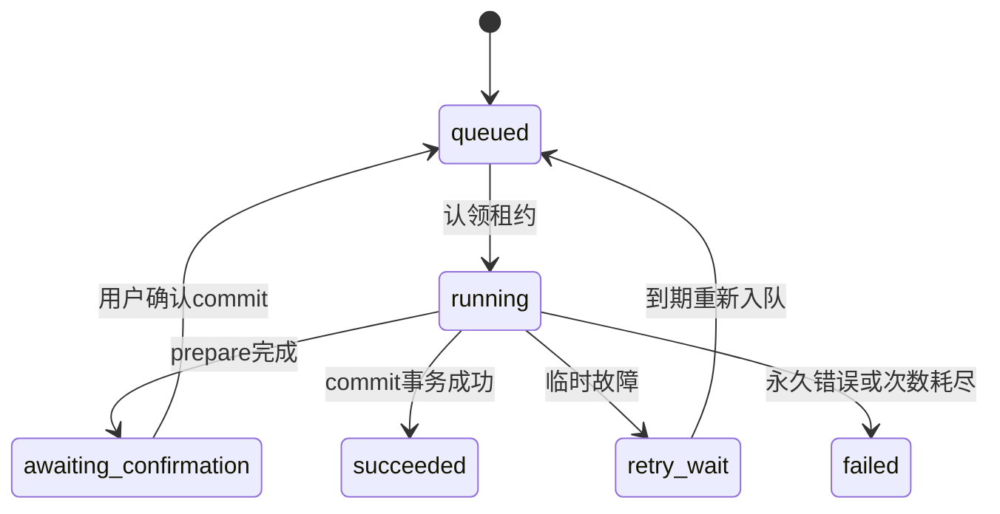

# Redis 7 与 RabbitMQ 任务方案

状态：**仅设计**。PG 保护业务事实；Redis 缓存可重建；RabbitMQ 负责投递工作通知。

## Redis key 与失效

| key | 值与 TTL | 故障策略 |
| --- | --- | --- |
| `vinyl:v1:session:{sidHash}` | userId、sessionVersion、csrf、创建/访问时间；空闲24h且不超过绝对7天 | 无法读取会话返回503；不存在/过期401；不回退匿名写入 |
| `vinyl:v1:rl:login:ip:{hash}` | 原子窗口计数，15分钟 | 登录/注册/改密限流依赖失败则503 |
| `vinyl:v1:rl:login:account:{hash}` | 失败次数，15分钟；初始10次/窗口 | 不永久锁死账户；返回429 + Retry-After |
| `vinyl:v1:rl:write:{userId}:{route}` | 写操作/导入上限，60秒 | 写操作限流失败关闭；按用例配置 |
| `vinyl:v1:catalog:release:{id}:{version}` | 已审核公共ReleaseDTO，300秒 | 缓存故障回源PG；不缓存 private DTO |
| `vinyl:v1:catalog:search:{queryHash}` | 公共搜索结果，60秒 | 包含 query/type/filter/sort/cursor；空结果TTL15秒 |
| `vinyl:v1:catalog:generation` | 目录变更世代号 | 未实现目录在线修改前可不启用；不能据此授权 |

初始登录IP上限30次/15分钟、账号10次/15分钟；注册IP5次/小时；导入用户5次/小时。限流使用Lua原子INCR+首次EXPIRE，不允许进程崩溃留下永不过期计数。实际容量在BC验证后调整。

同一 Redis 实例使用 `noeviction`：不为淘汰缓存而随机逐出会话。内存不足时缓存写失败可忽略并记录，创建会话失败必须503。Redis重启丢失会话允许要求重新登录；AOF提供恢复能力，但不是PG业务备份。生产容量与独立实例拆分属于后续部署决策。

私有收藏/愿望单首版不做 Redis 缓存，减少失效复杂度；TanStack Query 只保存用户范围的临时投影。列表写后由返回 DTO 或重新查询收敛。

## RabbitMQ 拓扑

| 项目 | 定义 |
| --- | --- |
| vhost | `/vinyl` |
| 主 exchange | `vinyl.jobs.v1`，durable direct |
| routing key | `imports.prepare.v1`、`imports.commit.v1` |
| 主队列 | 同名 routing key + `.q`，durable quorum |
| DLX / DLQ | `vinyl.dead.v1` / `vinyl.imports.dead.v1.q`，durable，dead路由为 `imports.dead.v1` |
| 投递 | persistent，messageId=outbox.id，publisher confirm + mandatory；处理 returned message |
| 消费 | manual ack，prefetch=4/进程，整体并发最多4，连接关闭后未ACK可重投 |

单容器 quorum 队列只有单成员，不宣称高可用；生产多节点拓扑是单独部署工作。自动重试由 PG 的 `next_attempt_at` 调度，不依赖延时插件或多层 TTL 队列。

bootstrap必须同时创建exchange、队列和binding：主队列设置 `x-queue-type=quorum`，绑定对应routing key；通过policy配置 `dead-letter-exchange=vinyl.dead.v1`、`dead-letter-routing-key=imports.dead.v1`、`dead-letter-strategy=at-least-once` 与 `overflow=reject-publish`。DLQ为quorum并绑定dead routing key。RabbitMQ默认delivery-limit不能代替PG业务attempt；超过broker投递限制进入DLQ后仍由PG租约巡检处理可恢复任务，避免只丢消息而任务永久running。

消息只发送 `{eventId, schemaVersion:1, type, jobId, phase, requestId}`。用户身份和业务输入从 PG 任务读取；不信任消息自报 owner，不发送密码、完整文件、音乐URL或完整歌词。

## 一次导入的状态与事务

`phase=prepare/commit` 单独区分工作，`status` 不用同一个字段暗示两种成功。prepare结束的有效/无效/已重复行对用户可见；未经确认永不提交收藏。

1. **受理**：API校验大小/格式并取得幂等键。在一个 PG 事务内创建 import_job 与 prepare Outbox，返回202及查询地址。202只意味着已受理。
2. **投递**：Relay 用短事务 `FOR UPDATE SKIP LOCKED` 认领50条，写 lease_token/lease_until（30秒）后提交，事务外发布。只有收到confirm且无return后，条件更新同一lease的 published_at。
3. **崩溃恢复**：发出消息后、写published_at前崩溃会再次投递同一eventId，属于预期至少一次语义；未确认不能把事件当成功。
4. **消费认领**：验证消息 schema，读取job，以 `status/phase/lease_until` 条件更新取得独立lease_token（60秒）。处理中每20秒续租；若租约丢失，旧worker不得提交结果。
5. **prepare**：事务外解析版本化 JSON、最多200条，生成规范化数据/错误/重复候选。短事务验证lease_token后落逐行结果、置awaiting_confirmation、写consumed_messages，然后ACK。
6. **用户确认**：commit API检查owner、version和有效行集合，把冻结选择存入job，phase改commit，version+1，与新Outbox同事务提交。重复确认同key返回原job；旧version返回412。
7. **commit**：无外部I/O，单个短事务创建所有选择的私人记录/公共收藏、写逐行inserted/skipped与最终统计、置succeeded、写消费去重。私人记录按user+import_fingerprint唯一约束归并重复导入，公共收藏按user+release唯一。出现DB异常则全回滚，不展示一半完成。prepare的重复判断只是预览，commit必须再次以数据库约束决定inserted/skipped。
8. **确认**：commit成功后ACK。若ACK丢失，重投时检查consumed_messages/任务终态直接ACK，不重复副作用。

不要在“刚收到消息”时写入consumed_messages并ACK；必须与该事件的业务终态/持久化重试安排同事务。收到正在被他人认领的重复消息可ACK该重复副本，PG租约巡检必须保证原worker崩溃后能恢复。

## 重试、死信与可观察恢复

- 数据库短暂连接故障、可重放事务死锁允许整个事务重试；格式错误、越权、未知event版本属于终止错误。
- 每阶段最多5次业务执行，退避5s/30s/2m/10m并加抖动。失败事务外不能假定已记录重试；只有 PG 原子写 `retry_wait,next_attempt_at` 和后续Outbox安排成功，才能ACK原消息。
- PG不可用时不ACK；有限退避后重建消费者连接以释放未ACK，避免 `nack(requeue=true)` 热循环。
- Worker巡检每30秒扫描过期lease或到期retry_wait，条件更新状态并创建新的eventId；旧worker通过lease_token条件失败阻止迟到写入。
- 永久失败：事务落 failed/error_code；再由事务Outbox发布dead审计消息。未能落库时不能仅将消息送死信并放弃任务。
- schema损坏/未知路由的消息拒绝requeue并送DLQ；任务若可识别，记录终止原因。DLQ监控告警，人工处理后只能通过经过授权的重试用例重发，禁止直接改PG状态冒充恢复。
- 监测 ready/unacked、DLQ数量、outbox最老等待、租约超时、失败率、任务耗时；携带requestId/eventId/jobId串联日志。

## 依赖故障时的页面行为

| 故障 | API行为 | 页面 |
| --- | --- | --- |
| RabbitMQ不可用、PG正常 | import仍可202（PG Outbox持久），任务停在queued | 显示“已受理，等待处理”；轮询退避，不显示已入库 |
| Redis不可用 | 公共目录可回源；认证/写请求503 | 保留表单，提示稍后重试，不清空当作退出 |
| PG不可用 | 业务503，不提交副作用 | 保留已有视图并标刷新失败；无本地假写 |
| 平台未接入 | 200+unavailable或capability=false | “暂无可用音源”，不启动模拟歌曲计时 |
| 提交响应丢失 | 同幂等键查询/重发获得原结果 | “正在确认结果”，禁止立即生成新key重写 |

真实验收需覆盖Rabbit重启、重复投递、commit后ACK前崩溃、lease过期和同账号重复导入；本方案没有宣称这些故障注入已通过。
