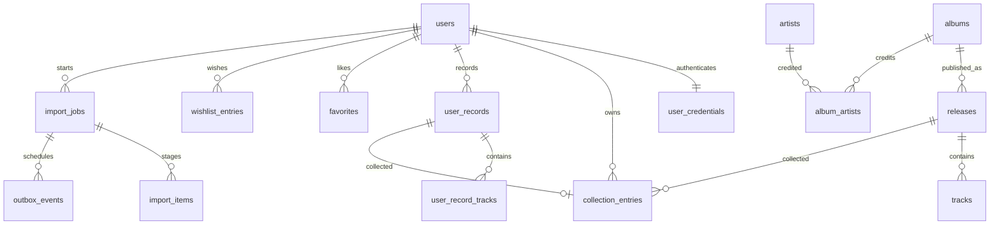

# PostgreSQL 18 数据模型

状态：**仅设计**。PG 是用户数据、目录与任务的持久事实源；Redis 清空或 MQ 重投不得重置收藏。字段采用 snake_case，DTO 采用 camelCase，使用明确 mapper。

## 从当前 Album 拆分

当前 [src/types.ts](../../src/types.ts) 的 Album 同时包含作品、发行版、用户品相、价格和 UI 状态。服务端拆成以下实体，前端通过 CatalogCard/CollectionEntry ViewModel 汇合，不复制这份大对象到所有表。



## 类型约定

- 主键 UUID（PG18 `uuidv7()` 或应用生成 UUID）；旧 demo ID 只进 `legacy_source_id` 映射，不能充当授权凭据。
- `created_at/updated_at`：`timestamptz NOT NULL`，UTC；`acquired_on`：date；时长 `duration_ms integer CHECK >= 0`。
- 金额 `integer` 最小货币单位，范围0–2,000,000,000，配 `currency char(3)`。未知金额为 NULL，不写0；当前 `price` 浮点元迁移时显式转为分并校验整数。
- 状态采用有 CHECK 的 text；版本 `integer NOT NULL DEFAULT 1 CHECK > 0`。
- 稳定事实不放 JSONB。只有来源原始摘要、已版本化任务输入/逐行校验结果可用 JSONB，校验 schemaVersion、条数与512KiB上限，不保留密码、token、完整歌词。
- 作品首发年 `original_year` 和发行版年份 `release_year` 分开；转速枚举 `33_1_3/45/78/unknown`，克重 `weight_grams`，前端负责格式化。
- `declared_track_count` 为来源声明数量，`tracks.length` 为已知曲目数量，二者不混用；不为补全总数而生成假曲目。

## 表与约束

| 表 | 关键列 | 不变量/删除策略 |
| --- | --- | --- |
| users | id、username_normalized、display_name、status、session_version、timestamps | 账号 UNIQUE；格式CHECK；status active/disabled；不提供首版账号删除 API |
| user_credentials | user_id、password_hash、algorithm、version、password_changed_at | PK/FK user_id，CASCADE；algorithm 固定 argon2id；hash PHC 不出 HTTP |
| artists | id、name、bio、image_url、source_id | 目录名称非唯一；来源FK RESTRICT；禁止 demo 关注数当事实 |
| albums | id、title、original_year、description、source_id | title非空；年份合法；来源FK RESTRICT |
| album_artists | album_id、artist_id、credit_order、role | 复合PK；关联FK RESTRICT；album+credit_order UNIQUE |
| genres / album_genres | id、name / album_id、genre_id | 名称唯一、关系复合PK；不以混合字符串替代筛选标签 |
| releases | id、album_id、release_year、label、edition、matrix_code、barcode、rpm、weight_grams、vinyl_variant、vinyl_colors、cover_url、declared_track_count、source_id | album/source FK RESTRICT；条码允许多版本，**不全局唯一**；颜色数组≤3且值校验 |
| tracks | id、release_id、disc_number、position、title、duration_ms、source_id | UNIQUE(release_id,disc_number,position)；非负时长；release FK RESTRICT |
| content_sources | id、kind、provider_id、external_id、source_url、license_status、review_status、observed_at | kind fixture/provider/user；状态受限；provider+external_id 部分唯一；未知授权不得标 licensed |
| user_records | id、user_id、title、artist_name、release_year、genre、label、edition、matrix_code、barcode、rpm、weight_grams、cover_url、vinyl_variant、vinyl_colors、version、timestamps | UNIQUE(user_id,id)供复合FK；所有数据只对 owner 可见；无全局目录写权 |
| user_record_tracks | id、user_id、record_id、position、title、duration_ms | FK(user_id,record_id)→user_records(user_id,id) CASCADE；位置唯一 |
| collection_entries | id、user_id、release_id?、record_id?、condition、purchase_price_minor?、currency?、notes、acquired_on?、version、created_at、updated_at | num_nonnulls(release_id,record_id)=1；两种目标各自按用户唯一；private目标复合FK，禁止跨用户挂接 |
| favorites | user_id、release_id、created_at | 复合PK；都FK，release RESTRICT；只表示喜欢，不代表实物拥有 |
| wishlist_entries | id、user_id、release_id、target_price_minor?、currency?、desired_condition?、notes、version、timestamps | UNIQUE(user_id,release_id)；价格/货币同时有值或同时NULL |
| editorial_issues / editorial_items | id、slug、title、published_at、source_id / issue_id、release_id、position、caption | slug唯一、位置唯一；只呈现审核且有来源的发布内容 |
| idempotency_records | user_scope、route_key、key、request_hash、state、response_status、response_json、expires_at | PK(user_scope,route_key,key)；请求hash不一致409；秘密字段不存 |
| import_jobs | id、user_id、phase、status、version、input_hash、input_json、lease_token、lease_until、attempt、next_attempt_at、error_code、timestamps | 明确状态机；user+id 唯一；数据校验通过才能确认；输入版本不可变 |
| import_items | job_id、row_number、normalized_json、validation_errors、status、collection_entry_id? | 复合PK；记录valid/invalid/duplicate/inserted/skipped；无静默丢行 |
| outbox_events | id、aggregate_id、event_type、schema_version、payload、available_at、lease_token、lease_until、published_at、attempt | PK；未投递部分索引；payload仅jobId、phase、eventVersion、requestId |
| consumed_messages | consumer_name、event_id、processed_at | 复合PK；完成业务短事务时写入去重 |

用户关系只在明确属于同生命周期时随用户清理；首版不暴露删除用户。移除收藏是删除一条收藏关系，不删公共目录、私人档案、喜欢或愿望单；再次入藏可以复用同一私人档案。

导入的私人档案额外保存 `user_records.import_fingerprint`（可空text，64位SHA-256 hex），并建立 `UNIQUE(user_id, import_fingerprint) WHERE import_fingerprint IS NOT NULL`。指纹来自版本化、规范化后的档案字段JSON（字段排序、补齐默认值，排除collection购入元数据）；它是导入去重键，不是所有录入的身份判断。commit先由该唯一约束取得已有recordId，再幂等入藏，不覆盖旧购入信息。并发/跨任务重复文件因此不会重复创建私人档案。手工录入不强制按标题合并；后续编辑也不重算原导入指纹。

旧demo稳定ID另由 `user_legacy_record_links(user_id, legacy_id, record_id)` 保存映射，PK(user_id,legacy_id)，复合FK约束record owner；与首次导入在同一事务写入。不要用当前数组下标或标题猜测映射。

## 数据库必须兜底的 SQL 形态

以下是迁移约束范式；完整迁移实现由 BC02 创建，不能当作已执行的 Migration：

```sql
ALTER TABLE collection_entries
  ADD CONSTRAINT collection_target_exactly_one
  CHECK (num_nonnulls(release_id, record_id) = 1);
CREATE UNIQUE INDEX collection_public_unique
  ON collection_entries(user_id, release_id) WHERE release_id IS NOT NULL;
CREATE UNIQUE INDEX collection_private_unique
  ON collection_entries(user_id, record_id) WHERE record_id IS NOT NULL;
ALTER TABLE collection_entries ADD CONSTRAINT collection_record_owner
  FOREIGN KEY (user_id, record_id)
  REFERENCES user_records(user_id, id) ON DELETE RESTRICT;
ALTER TABLE collection_entries ADD CONSTRAINT collection_price_pair
  CHECK ((purchase_price_minor IS NULL) = (currency IS NULL));
CREATE INDEX collection_recent
  ON collection_entries(user_id, created_at DESC, id DESC);
CREATE INDEX import_due
  ON import_jobs(next_attempt_at, id)
  WHERE status IN ('queued', 'retry_wait');
CREATE INDEX outbox_pending
  ON outbox_events(available_at, id) WHERE published_at IS NULL;
```

公共目录写入只来自受控种子/管理过程；私人记录创建、首次收藏、幂等结果在一个事务中提交。公开 releaseId 与私人 recordId 不采用“查询不到公共目录就读私人表”的模糊 fallback。

## 查询与缓存一致性

| 查询 | SQL/索引设计 | 验证 |
| --- | --- | --- |
| 我的收藏最近添加 | user_id + `(created_at,id)` 倒序 keyset | 并发插入时跨页无重复；少量新记录可在刷新后出现 |
| 我的收藏按艺术家/年份 | join 后按 normalized artist/year + id 排序，NULL顺序固定 | 先测典型用户规模；必要时新增专用查询投影，不先复制所有目录字段 |
| 全局搜索 | `pg_trgm` 对规范化标题、艺人名、曲目名GIN索引；各类型单独分页 | 2字符以上模糊搜索；1个汉字只走有限前缀查询，避免无界ILIKE |
| 条码匹配 | releases.barcode B-tree，保留前导0 | 返回候选数组，多版本由用户选择 |
| 导入任务 | job_id+user_id，认领使用条件UPDATE/短事务SKIP LOCKED | A用户不可读B任务；过期租约可重新认领 |

空列表返回200和空数组；未知资源/他人私人资源统一404。关联数据批量查询，不逐条请求曲目或艺术家。使用目标数据量（目录10万、单用户收藏1万的验收夹具）运行 EXPLAIN ANALYZE/BUFFERS 后才评价性能。

## Migration 与旧 demo 数据

1. `001_identity`：用户与凭据；独立 app/migrator 角色。
2. `002_catalog`：作品、发行版、曲目、艺人、流派、来源和策展。
3. `003_library`：私人档案、收藏、喜欢、愿望单与所有权约束。
4. `004_jobs`：导入、幂等、Outbox、消费去重、认领索引。
5. `005_search`：扩展、索引与查询验证；扩展由迁移角色安装。

版本一旦在共享环境执行即不改写。初始空库可用普通事务建索引；后续大表新增索引单独评估 CONCURRENTLY。每步记录 schema版本、耗时、失败恢复和验证SQL。

现有 ALBUMS/ARTISTS 的数组下标已不能作为可靠关系：艺人/愿望清单中的注释与当前数组顺序存在错配；有专辑声明曲目数与实际数组不一致。种子必须用稳定fixture映射显式校验并标 `fixture/unverified`，只进开发/测试库，不自动导入生产目录。

登录后发现 `vinyl_user_collection`：显示数量和预览，由用户确认后进入同一个 import API；旧ID映射只用于本次迁移去重。未知发行版转私人记录、错误逐条列出，不按标题合并不同版本。服务端确认入库并完成回读前不清理旧数据；本次不删除任何本地存储。
