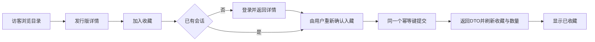

# 页面、导航与交互

状态：**仅设计**。正式业务使用URL路由，现有 `ScreenId` 仅作为迁移对照；浏览器后退、刷新详情和登录返回都必须可恢复。

## 页面到路由与API

以下路径是目标React路由；API路径均在 `/api/v1` 下。

| 画板 | 路由与入口 | 数据/动作 | 核心状态 |
| --- | --- | --- | --- |
| P01 首页 | `/`，启动/首页tab | GET releases，轻触→P03 | skeleton、空目录、保留内容刷新失败 |
| P02 收藏 | `/collection`，收藏tab | GET me/collection；加号→录入选择 | 访客登录、空、查询/排序、柜/列表切换 |
| P03 详情 | `/releases/:releaseId`；私人详情 `/records/:recordId` | GET release或private record；收藏/喜欢/愿望关系各自查询 | 已收藏、保存中、版本冲突、不可见 |
| P04 唱机 | `/player/:trackId`，曲目入口 | GET playback、providers | resolving、unavailable；未来ready/playing/buffering/error |
| P05 搜索 | `/search?q=`，搜索图标 | GET search按三种type分别请求 | 输入、加载、分区空、旧请求取消、各自更多 |
| P06 发现 | `/discover`，发现tab；`/editorial/:issueId` | GET issues/detail，关联releaseId | 示例标记、缺内容时无虚假文章入口 |
| P07 愿望 | `/wishlist`，我的/详情 | GET/POST/PATCH/DELETE wishlist | 目标价未填、编辑/移除、重复新增 |
| P08 我的 | `/me`，我的tab | GET me；数量入口进入各列表 | 访客说明、真实数量、登录失效 |
| P09 登录 | `/login?returnTo=` | POST login，再GET session | pending、统一凭据错误、429、503保留输入 |
| P10 注册 | `/register`，登录页 | POST register，成功回登录并预填账号 | 格式/占用/确认密码错误；不回填密码 |
| P11 设置 | `/settings`、`/settings/providers` | GET providers；PUT auth/password；POST logout | 所有平台尚未接入；改密/退出确认 |
| P12 导入 | `/imports/new`、`/imports/:jobId`，收藏加号/我的 | POST imports → GET job → POST commit → GET job | queued/running/待确认/retry_wait/成功/失败 |
| P13 艺术家 | `/artists/:artistId`，详情艺人名 | GET artist；后续GET releases?artistId | 已收录作品，空简介，不虚构关注数 |
| P14 歌词 | `/player/:trackId/lyrics`，播放器模式 | GET lyrics | unavailable与返回唱机；有来源后按媒体时间同步 |
| P15 状态板 | 非产品路由 | 各页面共享状态变体 | 加载、空、网络错、保存失败、结果未知 |
| P16 手工录入 | `/records/new`，收藏加号 | POST me/records，同事务档案+入藏 | 脏表单、字段错、保存中、已确认入藏 |
| P17 横屏展台 | `/showcase?releaseId=`，我的 | 复用release与封套 | 浏览器后退/退出；不强制自动旋转 |
| P18 启动 | 初次进入的欢迎层 | 开始浏览→首页；登录我的收藏→登录 | 可跳过，无模拟进度条、无重复强制展示 |

补充页面复用已有画板结构：`/favorites` 使用P05列表样式；`/imports` 使用P12任务行与异步状态；收藏/愿望编辑使用P16表单与对话框。每个入口必须挂上真实路由或动作，未实现能力不渲染可点击入口。

作品页首屏拿AlbumDetail内的release page，更多用 `/releases?albumId=`；艺术家同理。发行版详情用 `releaseId`；不能把作品ID或数组下标当发行版ID传到收藏接口。

## 核心流程

登录恢复页面不自动重复提交之前的写操作。401保留安全returnTo，用户看到明确操作后再提交。登录页允许密码管理器/粘贴/显示密码；不提供无身份核验的找回密码。改密码对话框包含当前密码、新密码、确认新密码，成功后解释“密码已更新，请重新登录”，清理旧会话投影。

### 入藏、编辑与移除

- 公共发行版已有规范档案：直接入藏，品相默认UNKNOWN、价格未知为null、备注为空。再次新增返回已有对象，不能重复计数或覆盖原备注。
- 手工录入：名称、艺术家必填；年份、版次、条码、转速、克重、彩胶、曲目、购入信息可展开。P16为首屏简版；年份和版次落地为独立字段，不解析斜杠拼接文本。
- 来源标签固定“私人档案·用户录入”；不让用户选择“已审核”。封面首版接受受限HTTPS URL或使用默认封套，不假设已有上传服务。
- 购入价格用十进制字符串解析为整数分；“320.00 CNY”→32000；禁止浮点乘100后无校验地提交。币种与金额成对修改。
- 编辑先GET对应资源与ETag。412保留输入并提供“查看最新/重新编辑”，不静默覆盖；提交失败保留所有字段。
- 移除需明确“从我的收藏移除”，成功后关闭详情中的收藏状态；不影响喜欢、愿望、公共档案。私人档案仍可凭原recordId重新入藏。

### 导入与旧localStorage迁移

1. 收藏加号展示“搜索目录 / 手工录入 / 导入文件”。批量格式为 `vinyl-v1` JSON，下载模板由同一schema生成；首版不伪装支持任意Excel/CSV。
2. 文件大小先本地检查；服务端仍校验整体1MiB、content512KiB和最多200条。POST受理后保留jobId，可离开并从导入任务列表恢复。
3. 待确认阶段展示valid/invalid/duplicate行及错误；默认选有效且非重复的行，用户可逐行取消。没有有效行时禁用确认按钮。
4. 用户确认只提交rowNumbers、当前ETag和稳定幂等键；202显示等待处理。job succeeded后刷新收藏/统计，显示真实insertedCount/skippedCount。
5. “返回修改”保留原预览供查看，编辑文件后创建新prepare任务；旧任务不在后台自动入藏。单个任务确认后不能修改输入。
6. 登录发现旧 `vinyl_user_collection` 时只显示一次迁移提示；经用户预览确认后走相同流程，回读成功前不清除旧内容。未知旧ID转私人记录。

## 视觉与响应式

- 深色背景、木纹只用于唱片场景；表单采用稳定深灰平面，保证可读性。绿色代表主要行动，橙色用于目标价；错误有文字，不只换颜色。
- 画板基准390×844；360–767px单栏，内容两侧24px（窄屏16px）。底栏考虑 `safe-area-inset-bottom`，表单正文可滚动，键盘不能遮住提交按钮。
- 768px以上延续现有居中手机容器，目标最大448px；横屏展台独立使用双栏。避免未经验证扩为桌面多侧栏产品。
- P02手机静态柜为每层4张示意；现有Three柜每层6张可保留为宽布局。分页是视图切片，必须继续读取服务端cursor，不能只在首批20张循环。
- 3D/翻页/转盘遵守 `prefers-reduced-motion`；提供可键盘操作的列表视图，WebGL失败回退封套列表。真实音乐未接入时黑胶只做展示，不伪造播放进度。

## 交互验收

每页验证入口→请求→服务端回读→返回/刷新；分别检查加载、空、错误、未登录、pending和成功。所有图标按钮有可访问名称，触控区域至少44×44，弹窗有焦点圈定/Escape/关闭后焦点返回。错误信息关联字段且经live region读出；自动焦点只到首个错误字段。
