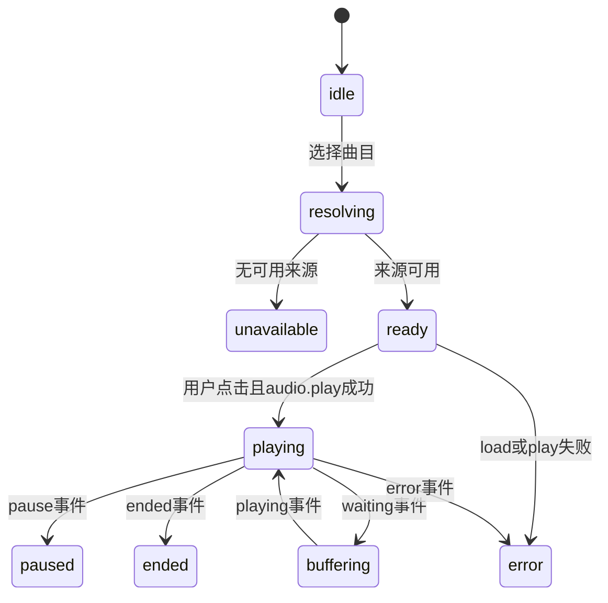

# React19 数据、路由与播放器接入

状态：**仅设计**。保留现有视觉组件，服务端事实迁到API；本次不移动根 `src/`。

## 状态归属

| 状态 | 目标位置 | 写后收敛 |
| --- | --- | --- |
| 目录、收藏、愿望、喜欢、账号统计、任务 | TanStack Query，包含用户ID的queryKey | 返回DTO或invalidate后回读 |
| 登录身份/CSRF | SessionProvider内存；随机session由HttpOnly Cookie携带 | 登录/改密/退出统一重置 |
| 搜索、筛选、排序、当前资源 | URL search params与React Router | 可分享/后退/刷新恢复 |
| modal、未提交字段、当前翻页动画 | 局部React state | 组件生命周期，失败保留输入 |
| 音量、减少动态效果、触感/音效偏好 | 版本化localStorage偏好 | 可丢失，不代表收藏或身份 |
| 当前曲目/队列/真实播放位置 | 唯一PlayerController | 音频事件是事实源 |

## 统一API client

`frontend/src/lib/api/client.ts` 统一处理相对baseUrl、credentials、requestId、CSRF、AbortSignal、超时与响应schema。feature service仅做operation调用和mapper；组件不直接fetch，不引用供应商SDK。

- 成功204直接返回void；JSON响应先校验Content-Type与schema；反向代理返回HTML或不匹配DTO必须抛ProtocolError，不伪装成空列表。
- GET默认最多重试2次并退避；4xx不重试。写操作不自动换幂等键；网络中断/超时显示“正在确认结果”，用户重试时复用同key与相同body。
- 用户每次确认产生一个UUID key；保存在该mutation上下文，直到得到确定结果。刷新导致上下文丢失时先查询任务/关系，不盲发新写。
- 401统一取消用户请求、清cache并转登录，returnTo仅允许本站路径；503保留输入和当前投影，不清身份当作退出。
- 400/422按error.fields关联表单；409显示占用/重复/幂等冲突；412回读当前对象；429显示Retry-After倒计时；5xx只展示通用message和requestId。
- 版本由ETag读取并与响应version核对；PATCH/DELETE/导入commit携带原If-Match，不用客户端时间戳代替版本。

## 查询与并发

| queryKey示意 | 请求 | 失效来源 |
| --- | --- | --- |
| `['catalog','releases',filters]` | GET releases | 目录显式刷新 |
| `['release',releaseId]` | GET releases/id | 目录变更/来源变化 |
| `['search',q,type]` | GET search | q/type变化立即取消旧请求 |
| `['user',userId,'collection',filters]` | GET me/collection | 入藏、编辑、移除、导入成功 |
| `['user',userId,'wishlist',filters]` | GET me/wishlist | 愿望增删改 |
| `['user',userId,'favorites',filters]` | GET me/favorites | 喜欢/取消 |
| `['user',userId,'profile']` | GET me | 所有关系写入后 |
| `['user',userId,'import',jobId]` | GET me/imports/id | 任务轮询、确认提交 |

资源详情按releaseId过滤查询当前收藏/愿望/喜欢，不能为判定一个按钮而下载整个账户列表。私人详情的查询与收藏关系用recordId。公共目录缓存可以跨账号；私人cache绝不跨账号沿用。

收藏/愿望写入首版采用pending后收敛，避免重复乐观计数。喜欢可做轻量乐观变更，但先cancel对应查询、保存snapshot、失败rollback，最终invalidate。相同关系写入串行化，不能连续快速点击制造PUT/DELETE响应乱序。

退出/换账号建立auth generation：取消在途私有请求并清缓存，response到达时确认仍属原用户代次；旧账号请求不得污染新账号页面。mutation失败时保留原上下文，但不能在新账号下自动补交。

导入轮询2s→5s→10s，页面隐藏时暂停，重新聚焦先GET一次。awaiting_confirmation和终态停止轮询；retry_wait显示稍后自动恢复。succeeded只失效一次收藏/统计，路由恢复也能读取结果。

## 音频与拟物视觉

`src/services/audioEngine.ts` 仅是音效，不能承担歌曲播放状态。迁移后保留独立音效开关，与音乐内容音量区分。

首版所有平台未配置，正常落点是unavailable，时间为0，播放/seek禁用，唱针不进入正在播放姿态。不能保留App的setInterval模拟歌曲时间作为正式模式。

接入授权媒体后再实现单个HTMLAudioElement：`currentTime/duration/seekable`、play/pause/waiting/ended/error驱动状态。UI动画可用rAF采样，但不生成独立播放时钟。`play()`拒绝、后台切换、过期URL、切歌Abort与seek都各自处理；未知duration不可拖动。

Web Audio跨域音源需要CORS；不支持分析时仍可原生播放，并显示静态波形，不以随机波形冒充音频频谱。HLS需另按目标浏览器验证原生或成熟播放器适配，本轮不把URL字符串视为已能播放。

## 迁移落点与验证

BC00迁工程且保持当前build；BC03先跑通账号与Cookie；BC04/05接目录和账户列表；BC06接导入；BC07接播放器不可用状态；BC08跑端到端回读。开发脚本和通过标准见[实施计划](../implementation-plan.md)。

每个feature至少验证一个真实HTTP→PG写→独立GET回读；A/B账号各一套。mock only用于外部平台和视觉样本，不能把MSW响应当数据库写入证据。
